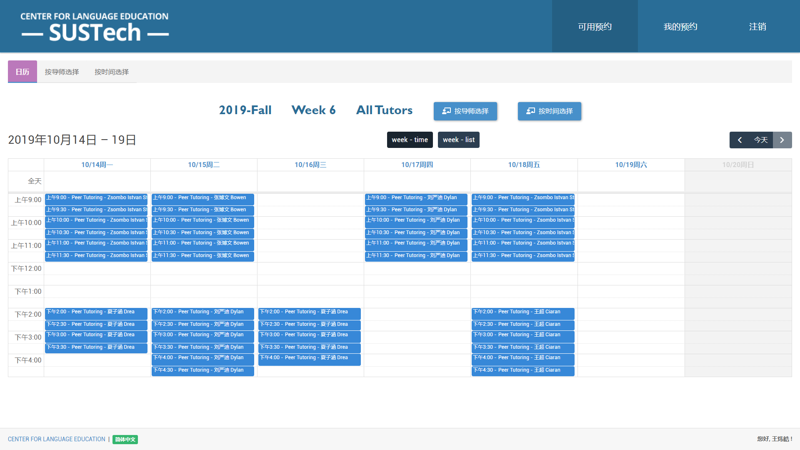
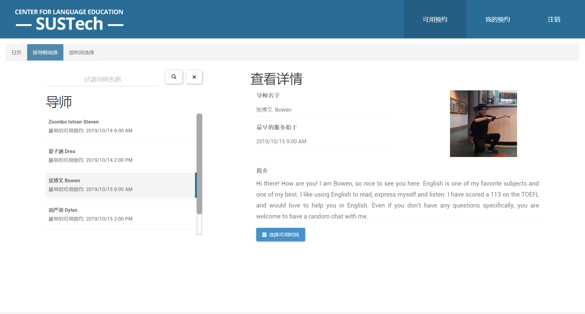
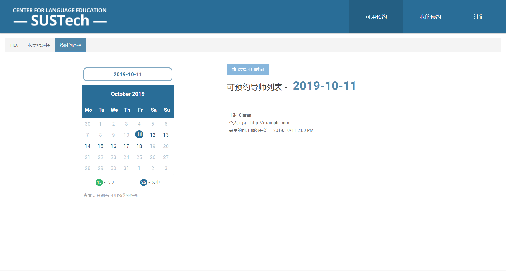
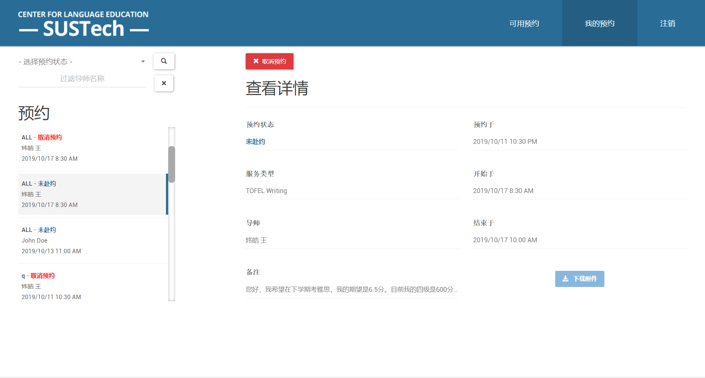

# 预约系统用户手册 - 用户

## 可用预约

用户可以在这个界面看到可用的预约，进行预约。

#### 日历

- 用户可以在日历中看到所有的可用预约，并可与在日历上面的深色按钮切换到列表模式。
-  **日历显示完整的一个教学周，所以要记得切换到下一页看看下一周有没有符合自己心意的服务噢~ **

#### 按导师选择

- 若用于已经有想要选择的导师，可以在这个页面中查看导师的简介和头像。
- 点击选择可用时间可以查看导师的排课日历。

#### 按时间选择

- 用户可以根据自己的时间安排，查看某一天有什么导师提供服务。

## 我的预约

- 用户可以在这个界面中看到所有和自己相关的预约。页面提供了搜索框和过滤框以便用户快速定位到某个预约。
- 用户可以点击取消预约，来取消某个预约。