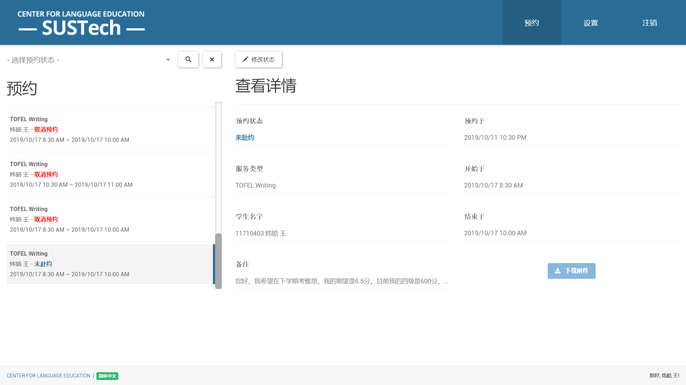

# 预约系统用户手册 - 导师

## 预约

- 管理员可以在预约界面，看到所有与自己有关的预约记录。页面提供了一个过滤器以便管理员可以快速定位到某个预约。
- 管理员可以在“查看详情”中查看到所有的预约信息。若学生有上传附件，管理员可以下载到相关的附件。
- 当服务完成后，管理员需要修改预约状态。

## 设置

- 导师可以在设置界面设置自己的信息，以便管理员或学生查看。
- 管理员可以看到导师的所有信息。
- 学生可以看到导师的名字、简介以及头像。